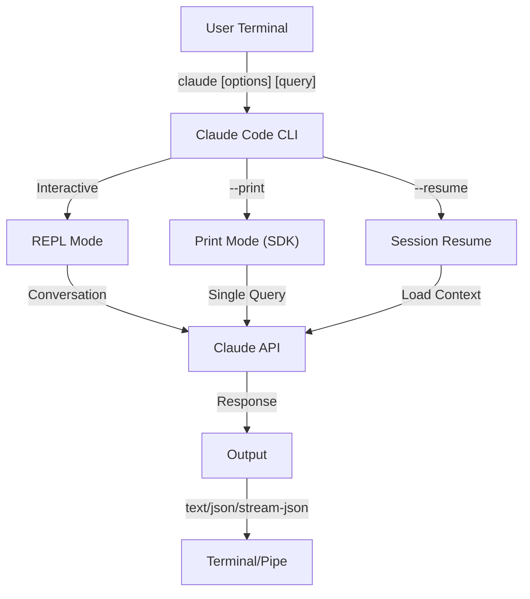

<picture>
  <source media="(prefers-color-scheme: dark)" srcset="../resources/logos/claude-howto-logo-dark.svg">
  
</picture>

# CLI Reference（CLI 参考）

## Overview（概述）

Claude Code CLI（命令行界面）是与 Claude Code 交互的主要方式。它为运行查询、管理会话、配置模型以及将 Claude 集成到开发工作流中提供了强大的选项。

## Architecture（架构）



## CLI Commands（CLI 命令）

| Command（命令） | Description（描述） | Example（示例） |
|---------|-------------|---------|
| `claude` | Start interactive REPL（启动交互式 REPL） | `claude` |
| `claude "query"` | Start REPL with initial prompt（使用初始提示词启动 REPL） | `claude "explain this project"` |
| `claude -p "query"` | Print mode - query then exit（打印模式 - 查询然后退出） | `claude -p "explain this function"` |
| `cat file \| claude -p "query"` | Process piped content（处理管道内容） | `cat logs.txt \| claude -p "explain"` |
| `claude -c` | Continue most recent conversation（继续最近的对话） | `claude -c` |
| `claude -c -p "query"` | Continue in print mode（在打印模式中继续） | `claude -c -p "check for type errors"` |
| `claude -r "<session>" "query"` | Resume session by ID or name（通过 ID 或名称恢复会话） | `claude -r "auth-refactor" "finish this PR"` |
| `claude update` | Update to latest version（更新到最新版本） | `claude update` |
| `claude mcp` | Configure MCP servers（配置 MCP 服务器） | See [MCP documentation](../05-mcp/) |
| `claude mcp serve` | Run Claude Code as an MCP server（将 Claude Code 作为 MCP 服务器运行） | `claude mcp serve` |
| `claude agents` | List all configured subagents（列出所有配置的子代理） | `claude agents` |
| `claude auto-mode defaults` | Print auto mode default rules as JSON（将自动模式默认规则打印为 JSON） | `claude auto-mode defaults` |
| `claude remote-control` | Start Remote Control server（启动远程控制服务器） | `claude remote-control` |
| `claude plugin` | Manage plugins (install, enable, disable)（管理插件（安装、启用、禁用）） | `claude plugin install my-plugin` |
| `claude auth login` | Log in (supports `--email`, `--sso`)（登录（支持 `--email`、`--sso`）） | `claude auth login --email user@example.com` |
| `claude auth logout` | Log out of current account（登出当前账户） | `claude auth logout` |
| `claude auth status` | Check auth status (exit 0 if logged in, 1 if not)（检查认证状态（已登录则退出 0，未登录则退出 1）） | `claude auth status` |

## Core Flags（核心标志）

| Flag | Description | Example |
|------|-------------|---------|
| `-p, --print` | Print response without interactive mode | `claude -p "query"` |
| `-c, --continue` | Load most recent conversation | `claude --continue` |
| `-r, --resume` | Resume specific session by ID or name | `claude --resume auth-refactor` |
| `-v, --version` | Output version number | `claude -v` |
| `-w, --worktree` | Start in isolated git worktree | `claude -w` |
| `-n, --name` | Session display name | `claude -n "auth-refactor"` |
| `--from-pr <number>` | Resume sessions linked to GitHub PR | `claude --from-pr 42` |
| `--remote "task"` | Create web session on claude.ai | `claude --remote "implement API"` |
| `--remote-control, --rc` | Interactive session with Remote Control | `claude --rc` |
| `--teleport` | Resume web session locally | `claude --teleport` |
| `--teammate-mode` | Agent team display mode | `claude --teammate-mode tmux` |
| `--bare` | Minimal mode (skip hooks, skills, plugins, MCP, auto memory, CLAUDE.md) | `claude --bare` |
| `--enable-auto-mode` | Unlock auto permission mode | `claude --enable-auto-mode` |
| `--channels` | Subscribe to MCP channel plugins | `claude --channels discord,telegram` |
| `--chrome` / `--no-chrome` | Enable/disable Chrome browser integration | `claude --chrome` |
| `--effort` | Set thinking effort level | `claude --effort high` |
| `--init` / `--init-only` | Run initialization hooks | `claude --init` |
| `--maintenance` | Run maintenance hooks and exit | `claude --maintenance` |
| `--disable-slash-commands` | Disable all skills and slash commands | `claude --disable-slash-commands` |
| `--no-session-persistence` | Disable session saving (print mode) | `claude -p --no-session-persistence "query"` |

### Interactive vs Print Mode（交互模式 vs 打印模式）

**Interactive Mode（交互模式）**（默认）：
```bash
# Start interactive session
claude

# Start with initial prompt
claude "explain the authentication flow"
```

**Print Mode（打印模式）**（非交互式）：
```bash
# Single query, then exit
claude -p "what does this function do?"

# Process file content
cat error.log | claude -p "explain this error"

# Chain with other tools
claude -p "list todos" | grep "URGENT"
```

## Model & Configuration（模型与配置）

| Flag | Description | Example |
|------|-------------|---------|
| `--model` | Set model (sonnet, opus, haiku, or full name) | `claude --model opus` |
| `--fallback-model` | Automatic model fallback when overloaded | `claude -p --fallback-model sonnet "query"` |
| `--agent` | Specify agent for session | `claude --agent my-custom-agent` |
| `--agents` | Define custom subagents via JSON | See [Agents Configuration](#agents-configuration) |
| `--effort` | Set effort level (low, medium, high, max) | `claude --effort high` |

### Model Selection Examples（模型选择示例）

```bash
# Use Opus 4.6 for complex tasks
claude --model opus "design a caching strategy"

# Use Haiku 4.5 for quick tasks
claude --model haiku -p "format this JSON"

# Full model name
claude --model claude-sonnet-4-6-20250929 "review this code"

# With fallback for reliability
claude -p --model opus --fallback-model sonnet "analyze architecture"

# Use opusplan (Opus plans, Sonnet executes)
claude --model opusplan "design and implement the caching layer"
```

## System Prompt Customization（系统提示词自定义）

| Flag | Description | Example |
|------|-------------|---------|
| `--system-prompt` | Replace entire default prompt | `claude --system-prompt "You are a Python expert"` |
| `--system-prompt-file` | Load prompt from file (print mode) | `claude -p --system-prompt-file ./prompt.txt "query"` |
| `--append-system-prompt` | Append to default prompt | `claude --append-system-prompt "Always use TypeScript"` |

## Tool & Permission Management（工具和权限管理）

| Flag | Description | Example |
|------|-------------|---------|
| `--tools` | Restrict available built-in tools | `claude -p --tools "Bash,Edit,Read" "query"` |
| `--allowedTools` | Tools that execute without prompting | `"Bash(git log:*)" "Read"` |
| `--disallowedTools` | Tools removed from context | `"Bash(rm:*)" "Edit"` |
| `--dangerously-skip-permissions` | Skip all permission prompts | `claude --dangerously-skip-permissions` |
| `--permission-mode` | Begin in specified permission mode | `claude --permission-mode auto` |
| `--permission-prompt-tool` | MCP tool for permission handling | `claude -p --permission-prompt-tool mcp_auth "query"` |
| `--enable-auto-mode` | Unlock auto permission mode | `claude --enable-auto-mode` |

### Permission Examples（权限示例）

```bash
# Read-only mode for code review
claude --permission-mode plan "review this codebase"

# Restrict to safe tools only
claude --tools "Read,Grep,Glob" -p "find all TODO comments"

# Allow specific git commands without prompts
claude --allowedTools "Bash(git status:*)" "Bash(git log:*)"

# Block dangerous operations
claude --disallowedTools "Bash(rm -rf:*)" "Bash(git push --force:*)"
```

## Output & Format（输出和格式）

| Flag | Description | Options | Example |
|------|-------------|---------|---------|
| `--output-format` | Specify output format (print mode) | `text`, `json`, `stream-json` | `claude -p --output-format json "query"` |
| `--input-format` | Specify input format (print mode) | `text`, `stream-json` | `claude -p --input-format stream-json` |
| `--verbose` | Enable verbose logging | | `claude --verbose` |
| `--include-partial-messages` | Include streaming events | Requires `stream-json` | `claude -p --output-format stream-json --include-partial-messages "query"` |
| `--json-schema` | Get validated JSON matching schema | | `claude -p --json-schema '{"type":"object"}' "query"` |
| `--max-budget-usd` | Maximum spend for print mode | | `claude -p --max-budget-usd 5.00 "query"` |

### Output Format Examples（输出格式示例）

```bash
# Plain text (default)
claude -p "explain this code"

# JSON for programmatic use
claude -p --output-format json "list all functions in main.py"

# Streaming JSON for real-time processing
claude -p --output-format stream-json "generate a long report"

# Structured output with schema validation
claude -p --json-schema '{"type":"object","properties":{"bugs":{"type":"array"}}}' \
  "find bugs in this code and return as JSON"
```

## Workspace & Directory（工作区和目录）

| Flag | Description | Example |
|------|-------------|---------|
| `--add-dir` | Add additional working directories | `claude --add-dir ../apps ../lib` |
| `--setting-sources` | Comma-separated setting sources | `claude --setting-sources user,project` |
| `--settings` | Load settings from file or JSON | `claude --settings ./settings.json` |
| `--plugin-dir` | Load plugins from directory (repeatable) | `claude --plugin-dir ./my-plugin` |

## Session Management（会话管理）

| Flag | Description | Example |
|------|-------------|---------|
| `--session-id` | Use specific session ID (UUID) | `claude --session-id "550e8400-..."` |
| `--fork-session` | Create new session when resuming | `claude --resume abc123 --fork-session` |

### Session Examples（会话示例）

```bash
# Continue last conversation
claude -c

# Resume named session
claude -r "feature-auth" "continue implementing login"

# Fork session for experimentation
claude --resume feature-auth --fork-session "try alternative approach"

# Use specific session ID
claude --session-id "550e8400-e29b-41d4-a716-446655440000" "continue"
```

## High-Value Use Cases（高价值用例）

### 1. CI/CD Integration（CI/CD 集成）

```yaml
name: AI Code Review

on: [pull_request]

jobs:
  review:
    runs-on: ubuntu-latest
    steps:
      - uses: actions/checkout@v4

      - name: Install Claude Code
        run: npm install -g @anthropic-ai/claude-code

      - name: Run Code Review
        env:
          ANTHROPIC_API_KEY: ${{ secrets.ANTHROPIC_API_KEY }}
        run: |
          claude -p --output-format json \
            --max-turns 1 \
            "Review the changes in this PR for:
            - Security vulnerabilities
            - Performance issues
            - Code quality
            Output as JSON with 'issues' array" > review.json
```

### 2. Script Piping（脚本管道）

```bash
# Analyze error logs
tail -1000 /var/log/app/error.log | claude -p "summarize these errors and suggest fixes"

# Find patterns in access logs
cat access.log | claude -p "identify suspicious access patterns"

# Analyze git history
git log --oneline -50 | claude -p "summarize recent development activity"
```

### 3. JSON API Integration（JSON API 集成）

```bash
# Get structured analysis
claude -p --output-format json \
  --json-schema '{"type":"object","properties":{"functions":{"type":"array"},"complexity":{"type":"string"}}}' \
  "analyze main.py and return function list with complexity rating"

# Integrate with jq for processing
claude -p --output-format json "list all API endpoints" | jq '.endpoints[]'
```

## Models（模型）

Claude Code supports multiple models with different capabilities:

| Model | ID | Context Window | Notes |
|-------|-----|----------------|-------|
| Opus 4.6 | `claude-opus-4-6` | 1M tokens | Most capable, adaptive effort levels |
| Sonnet 4.6 | `claude-sonnet-4-6` | 1M tokens | Balanced speed and capability |
| Haiku 4.5 | `claude-haiku-4-5` | 1M tokens | Fastest, best for quick tasks |

## Quick Reference（快速参考）

### Most Common Commands（最常用命令）

```bash
# Interactive session
claude

# Quick question
claude -p "how do I..."

# Continue conversation
claude -c

# Process a file
cat file.py | claude -p "review this"

# JSON output for scripts
claude -p --output-format json "query"
```

### Flag Combinations（标志组合）

| Use Case | Command |
|----------|---------|
| Quick code review | `cat file | claude -p "review"` |
| Structured output | `claude -p --output-format json "query"` |
| Safe exploration | `claude --permission-mode plan` |
| Autonomous with safety | `claude --enable-auto-mode --permission-mode auto` |
| CI/CD integration | `claude -p --max-turns 3 --output-format json` |
| Resume work | `claude -r "session-name"` |
| Custom model | `claude --model opus "complex task"` |
| Minimal mode | `claude --bare "quick query"` |
| Budget-capped run | `claude -p --max-budget-usd 2.00 "analyze code"` |

## Troubleshooting（故障排除）

### Command Not Found

**Problem**: `claude: command not found`

**Solutions:**
- Install Claude Code: `npm install -g @anthropic-ai/claude-code`
- Check PATH includes npm global bin directory
- Try running with full path: `npx claude`

### API Key Issues

**Problem**: Authentication failed

**Solutions:**
- Set API key: `export ANTHROPIC_API_KEY=your-key`
- Check key is valid and has sufficient credits
- Verify key permissions for the model requested

### Session Not Found

**Problem**: Cannot resume session

**Solutions:**
- List available sessions to find correct name/ID
- Sessions may expire after period of inactivity
- Use `-c` to continue most recent session

### Permission Denied

**Problem**: Tool execution blocked

**Solutions:**
- Check `--permission-mode` setting
- Review `--allowedTools` and `--disallowedTools` flags
- Use `--dangerously-skip-permissions` for automation (with caution)

## Additional Resources（其他资源）

- **[Official CLI Reference](https://code.claude.com/docs/en/cli-reference)** - Complete command reference
- **[Headless Mode Documentation](https://code.claude.com/docs/en/headless)** - Automated execution
- **[Slash Commands](../01-slash-commands/)** - Custom shortcuts within Claude
- **[Memory Guide](../02-memory/)** - Persistent context via CLAUDE.md
- **[MCP Protocol](../05-mcp/)** - External tool integrations
- **[Advanced Features](../09-advanced-features/)** - Planning mode, extended thinking
- **[Subagents Guide](../04-subagents/)** - Delegated task execution
