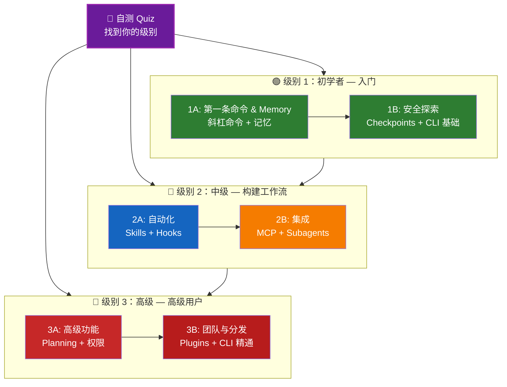

<picture>
  <source media="(prefers-color-scheme: dark)" srcset="resources/logos/claude-howto-logo-dark.svg">
  
</picture>

# Claude Code 学习路线图

**Claude Code 新手？** 本指南帮助你按自己的节奏掌握 Claude Code 功能。无论你是完全的新手还是有经验的开发者，都可以从下面的自测 quiz 开始，找到适合你的路径。

---

## 找到你的级别

并非每个人都从同一起点出发。参加这个快速自测，找到正确的入口。

**诚实回答这些问题：**

- [ ] 我可以启动 Claude Code 并进行对话（`claude`）
- [ ] 我已创建或编辑过 CLAUDE.md 文件
- [ ] 我使用过至少 3 个内置斜杠命令（如 /help、/compact、/model）
- [ ] 我创建过自定义斜杠命令或 skill（SKILL.md）
- [ ] 我配置过 MCP 服务器（如 GitHub、数据库）
- [ ] 我在 ~/.claude/settings.json 中设置过 hooks
- [ ] 我创建过或使用过自定义 subagents（.claude/agents/）
- [ ] 我使用过打印模式（`claude -p`）进行脚本编写或 CI/CD

**你的级别：**

| 勾选数 | 级别 | 从哪里开始 | 完成时间 |
|--------|-------|----------|------------------|
| 0-2 | **级别 1：初学者** — 入门 | [里程碑 1A](#里程碑-1a-第一条命令--memory) | 约 3 小时 |
| 3-5 | **级别 2：中级** — 构建工作流 | [里程碑 2A](#里程碑-2a-自动化--skills--hooks) | 约 5 小时 |
| 6-8 | **级别 3：高级** — 高级用户和团队负责人 | [里程碑 3A](#里程碑-3a-高级功能) | 约 5 小时 |

> **提示**：如果不确定，从低一级开始。快速复习熟悉的内容比错过基础概念要好。

> **交互版本**：在 Claude Code 中运行 `/self-assessment`，获取引导式互动 quiz，评估你所有 10 个功能领域的熟练程度，并生成个性化学习路径。

---

## 学习理念

本仓库中的文件夹按**推荐学习顺序**编号，基于三个关键原则：

1. **依赖关系** - 基础概念优先
2. **复杂性** - 简单功能在前，高级功能在后
3. **使用频率** - 最常用的功能提前教

这种方法确保你在获得即时生产力的同时建立坚实基础。

---

## 你的学习路径



**颜色图例：**
- 紫色：自测 Quiz
- 绿色：级别 1 — 初学者路径
- 蓝色/金色：级别 2 — 中级路径
- 红色：级别 3 — 高级路径

---

## 完整路线图表格

| 步骤 | 功能 | 复杂度 | 时间 | 级别 | 依赖项 | 为什么要学 | 关键收益 |
|------|---------|-----------|------|-------|--------------|----------------|--------------|
| **1** | [斜杠命令](01-slash-commands/) | ⭐ 初学者 | 30 分钟 | 级别 1 | 无 | 快速提升生产力（55+ 内置 + 5 个捆绑 skills） | 即时自动化、团队标准 |
| **2** | [Memory](02-memory/) | ⭐⭐ 初级+ | 45 分钟 | 级别 1 | 无 | 所有功能必需 | 持久化上下文、偏好设置 |
| **3** | [Checkpoints](08-checkpoints/) | ⭐⭐ 中级 | 45 分钟 | 级别 1 | 会话管理 | 安全探索 | 实验、恢复 |
| **4** | [CLI 基础](10-cli/) | ⭐⭐ 初级+ | 30 分钟 | 级别 1 | 无 | 核心 CLI 使用 | 交互和打印模式 |
| **5** | [Skills](03-skills/) | ⭐⭐ 中级 | 1 小时 | 级别 2 | 斜杠命令 | 自动专业知识 | 可复用能力、一致性 |
| **6** | [Hooks](06-hooks/) | ⭐⭐ 中级 | 1 小时 | 级别 2 | 工具、命令 | 工作流自动化（25 个事件，4 种类型） | 验证、质量门禁 |
| **7** | [MCP](05-mcp/) | ⭐⭐⭐ 中级+ | 1 小时 | 级别 2 | 配置 | 实时数据访问 | 实时集成、API |
| **8** | [Subagents](04-subagents/) | ⭐⭐⭐ 中级+ | 1.5 小时 | 级别 2 | Memory、命令 | 复杂任务处理（6 个内置，包括 Bash） | 委托、专业知识 |
| **9** | [高级功能](09-advanced-features/) | ⭐⭐⭐⭐⭐ 高级 | 2-3 小时 | 级别 3 | 所有先前内容 | 高级用户工具 | Planning、Auto Mode、Channels、语音听写、权限 |
| **10** | [Plugins](07-plugins/) | ⭐⭐⭐⭐ 高级 | 2 小时 | 级别 3 | 所有先前内容 | 完整解决方案 | 团队 onboarding、分发 |
| **11** | [CLI 精通](10-cli/) | ⭐⭐⭐ 高级 | 1 小时 | 级别 3 | 推荐：全部 | 精通命令行使用 | 脚本编写、CI/CD、自动化 |

**总学习时间**：约 11-13 小时（或直接跳到你的级别节省时间）

---

## 级别 1：初学者 — 入门

**适合**：自测勾选 0-2 个
**时间**：约 3 小时
**重点**：即时生产力、理解基础
**成果**：舒适的日常用户，准备好进入级别 2

### 里程碑 1A：第一条命令 & Memory

**主题**：斜杠命令 + Memory
**时间**：1-2 小时
**复杂度**：⭐ 初学者
**目标**：通过自定义命令和持久化上下文立即提升生产力

#### 你将实现的目标
- [ ] 创建自定义斜杠命令处理重复任务
- [ ] 设置团队标准的项目 memory
- [ ] 配置个人偏好设置
- [ ] 理解 Claude 如何自动加载上下文

#### 实践练习

```bash
# 练习 1：安装你的第一个斜杠命令
mkdir -p .claude/commands
cp 01-slash-commands/optimize.md .claude/commands/

# 练习 2：创建项目 memory
cp 02-memory/project-CLAUDE.md ./CLAUDE.md

# 练习 3：试试看
# 在 Claude Code 中输入：/optimize
```

#### 成功标准
- [ ] 成功调用 `/optimize` 命令
- [ ] Claude 从 CLAUDE.md 记住你的项目标准
- [ ] 你理解何时使用斜杠命令 vs. memory

#### 下一步
熟悉后，阅读：
- [01-slash-commands/README.md](01-slash-commands/README.md)
- [02-memory/README.md](02-memory/README.md)

> **检验你的理解**：在 Claude Code 中运行 `/lesson-quiz slash-commands` 或 `/lesson-quiz memory` 来测试你所学的内容。

---

### 里程碑 1B：安全探索

**主题**：Checkpoints + CLI 基础
**时间**：1 小时
**复杂度**：⭐⭐ 初级+
**目标**：学会安全实验和使用核心 CLI 命令

#### 你将实现的目标
- [ ] 创建和恢复 checkpoints 以进行安全实验
- [ ] 理解交互模式 vs. 打印模式
- [ ] 使用基本 CLI 标志和选项
- [ ] 通过管道处理文件

#### 实践练习

```bash
# 练习 1：尝试 checkpoint 工作流
# 在 Claude Code 中：
# 进行一些实验性更改，然后按 Esc+Esc 或使用 /rewind
# 选择实验之前的 checkpoint
# 选择"恢复代码和对话"返回

# 练习 2：交互模式 vs 打印模式
claude "explain this project"           # 交互模式
claude -p "explain this function"       # 打印模式（非交互）

# 练习 3：通过管道处理文件内容
cat error.log | claude -p "explain this error"
```

#### 成功标准
- [ ] 创建并恢复到过一个 checkpoint
- [ ] 使用过交互模式和打印模式
- [ ] 将文件管道传输给 Claude 进行分析
- [ ] 理解何时使用 checkpoints 进行安全实验

#### 下一步
- 阅读：[08-checkpoints/README.md](08-checkpoints/README.md)
- 阅读：[10-cli/README.md](10-cli/README.md)
- **准备好进入级别 2！** 继续[里程碑 2A](#里程碑-2a-自动化--skills--hooks)

> **检验你的理解**：运行 `/lesson-quiz checkpoints` 或 `/lesson-quiz cli` 来验证你已准备好进入级别 2。

---

## 级别 2：中级 — 构建工作流

**适合**：自测勾选 3-5 个
**时间**：约 5 小时
**重点**：自动化、集成、任务委托
**成果**：自动化工作流、外部集成、准备好进入级别 3

### 前置条件检查

在开始级别 2 之前，确保你熟悉以下级别 1 概念：

- [ ] 可以创建和使用斜杠命令（[01-slash-commands/](01-slash-commands/)）
- [ ] 已通过 CLAUDE.md 设置项目 memory（[02-memory/](02-memory/)）
- [ ] 知道如何创建和恢复 checkpoints（[08-checkpoints/](08-checkpoints/)）
- [ ] 可以从命令行使用 `claude` 和 `claude -p`（[10-cli/](10-cli/)）

> **有差距？** 继续之前复习上面链接的教程。

---

### 里程碑 2A：自动化（Skills + Hooks）

**主题**：Skills + Hooks
**时间**：2-3 小时
**复杂度**：⭐⭐ 中级
**目标**：自动化常见工作流和质量检查

#### 你将实现的目标
- [ ] 通过 YAML frontmatter 自动调用专业能力（包括 `effort` 和 `shell` 字段）
- [ ] 设置跨 25 个 hook 事件的事件驱动自动化
- [ ] 使用所有 4 种 hook 类型（command、http、prompt、agent）
- [ ] 强制执行代码质量标准
- [ ] 为你的工作流创建自定义 hooks

#### 实践练习

```bash
# 练习 1：安装一个 skill
cp -r 03-skills/code-review ~/.claude/skills/

# 练习 2：设置 hooks
mkdir -p ~/.claude/hooks
cp 06-hooks/pre-tool-check.sh ~/.claude/hooks/
chmod +x ~/.claude/hooks/pre-tool-check.sh

# 练习 3：在设置中配置 hooks
# 添加到 ~/.claude/settings.json：
{
  "hooks": {
    "PreToolUse": [
      {
        "matcher": "Bash",
        "hooks": [
          {
            "type": "command",
            "command": "~/.claude/hooks/pre-tool-check.sh"
          }
        ]
      }
    ]
  }
}
```

#### 成功标准
- [ ] 代码审查 skill 在相关时自动调用
- [ ] PreToolUse hook 在工具执行前运行
- [ ] 你理解 skill 自动调用 vs. hook 事件触发

#### 下一步
- 创建你自己的自定义 skill
- 为你的工作流设置额外的 hooks
- 阅读：[03-skills/README.md](03-skills/README.md)
- 阅读：[06-hooks/README.md](06-hooks/README.md)

> **检验你的理解**：在继续之前运行 `/lesson-quiz skills` 或 `/lesson-quiz hooks` 来测试你的知识。

---

### 里程碑 2B：集成（MCP + Subagents）

**主题**：MCP + Subagents
**时间**：2-3 小时
**复杂度**：⭐⭐⭐ 中级+
**目标**：集成外部服务并委托复杂任务

#### 你将实现的目标
- [ ] 从 GitHub、数据库等访问实时数据
- [ ] 委托工作给专业 AI agents
- [ ] 理解何时使用 MCP vs. subagents
- [ ] 构建集成工作流

#### 实践练习

```bash
# 练习 1：设置 GitHub MCP
export GITHUB_TOKEN="your_github_token"
claude mcp add github -- npx -y @modelcontextprotocol/server-github

# 练习 2：测试 MCP 集成
# 在 Claude Code 中：/mcp__github__list_prs

# 练习 3：安装 subagents
mkdir -p .claude/agents
cp 04-subagents/*.md .claude/agents/
```

#### 集成练习
尝试这个完整工作流：
1. 使用 MCP 获取 GitHub PR
2. 让 Claude 将审查委托给 code-reviewer subagent
3. 使用 hooks 自动运行测试

#### 成功标准
- [ ] 成功通过 MCP 查询 GitHub 数据
- [ ] Claude 将复杂任务委托给 subagents
- [ ] 你理解 MCP 和 subagents 之间的区别
- [ ] 在工作流中组合了 MCP + subagents + hooks

#### 下一步
- 设置额外的 MCP 服务器（数据库、Slack 等）
- 为你的领域创建自定义 subagents
- 阅读：[05-mcp/README.md](05-mcp/README.md)
- 阅读：[04-subagents/README.md](04-subagents/README.md)
- **准备好进入级别 3！** 继续[里程碑 3A](#里程碑-3a-高级功能)

> **检验你的理解**：运行 `/lesson-quiz mcp` 或 `/lesson-quiz subagents` 来验证你已准备好进入级别 3。

---

## 级别 3：高级 — 高级用户和团队负责人

**适合**：自测勾选 6-8 个
**时间**：约 5 小时
**重点**：团队工具、CI/CD、企业功能、plugin 开发
**成果**：高级用户，可以设置团队工作流和 CI/CD

### 前置条件检查

在开始级别 3 之前，确保你熟悉以下级别 2 概念：

- [ ] 可以创建和使用带自动调用的 skills（[03-skills/](03-skills/)）
- [ ] 已设置用于事件驱动自动化的 hooks（[06-hooks/](06-hooks/)）
- [ ] 可以配置用于外部数据的 MCP 服务器（[05-mcp/](05-mcp/)）
- [ ] 知道如何使用 subagents 进行任务委托（[04-subagents/](04-subagents/)）

> **有差距？** 继续之前复习上面链接的教程。

---

### 里程碑 3A：高级功能

**主题**：高级功能（Planning、权限、扩展思考、Auto Mode、Channels、语音听写、远程/桌面/网页）
**时间**：2-3 小时
**复杂度**：⭐⭐⭐⭐⭐ 高级
**目标**：掌握高级工作流和高级用户工具

#### 你将实现的目标
- [ ] Planning 模式处理复杂功能
- [ ] 通过 6 种模式进行细粒度权限控制（default、acceptEdits、plan、auto、dontAsk、bypassPermissions）
- [ ] 通过 Alt+T / Option+T 切换扩展思考
- [ ] 后台任务管理
- [ ] Auto Memory 学习偏好设置
- [ ] 带后台安全分类器的 Auto Mode
- [ ] 用于结构化多会话工作流的 Channels
- [ ] 用于免手操作的语音听写
- [ ] 远程控制、桌面应用和网页会话
- [ ] 用于多智能体协作的 Agent Teams

#### 实践练习

```bash
# 练习 1：使用 planning 模式
/plan Implement user authentication system

# 练习 2：尝试权限模式（6 种可用：default、acceptEdits、plan、auto、dontAsk、bypassPermissions）
claude --permission-mode plan "analyze this codebase"
claude --permission-mode acceptEdits "refactor the auth module"
claude --permission-mode auto "implement the feature"

# 练习 3：启用扩展思考
# 在会话期间按 Alt+T（macOS 上为 Option+T）切换

# 练习 4：高级 checkpoint 工作流
# 1. 创建 checkpoint "Clean state"
# 2. 使用 planning 模式设计功能
# 3. 通过 subagent 委托实现
# 4. 在后台运行测试
# 5. 如果测试失败，回溯到 checkpoint
# 6. 尝试替代方法

# 练习 5：尝试 auto 模式（后台安全分类器）
claude --permission-mode auto "implement user settings page"

# 练习 6：启用 agent teams
export CLAUDE_AGENT_TEAMS=1
# 问 Claude："使用团队方法实现功能 X"

# 练习 7：计划任务
/loop 5m /check-status
# 或使用 CronCreate 进行持久计划任务

# 练习 8：用于多会话工作流的 Channels
# 使用 channels 跨会话组织工作

# 练习 9：语音听写
# 使用语音输入进行免手操作与 Claude Code 交互
```

#### 成功标准
- [ ] 使用 planning 模式处理复杂功能
- [ ] 配置权限模式（plan、acceptEdits、auto、dontAsk）
- [ ] 使用 Alt+T / Option+T 切换扩展思考
- [ ] 使用带后台安全分类器的 auto 模式
- [ ] 使用后台任务处理长时间运行的操作
- [ ] 探索 Channels 用于多会话工作流
- [ ] 尝试语音听写进行免手输入
- [ ] 理解远程控制、桌面应用和网页会话
- [ ] 启用并使用 Agent Teams 进行协作任务
- [ ] 使用 `/loop` 进行重复任务或计划监控

#### 下一步
- 阅读：[09-advanced-features/README.md](09-advanced-features/README.md)

> **检验你的理解**：运行 `/lesson-quiz advanced` 来测试你对高级用户功能的掌握程度。

---

### 里程碑 3B：团队与分发（Plugins + CLI 精通）

**主题**：Plugins + CLI 精通 + CI/CD
**时间**：2-3 小时
**复杂度**：⭐⭐⭐⭐ 高级
**目标**：构建团队工具、创建 plugins、掌握 CI/CD 集成

#### 你将实现的目标
- [ ] 安装和创建完整的捆绑 plugins
- [ ] 掌握用于脚本和自动化的 CLI
- [ ] 使用 `claude -p` 设置 CI/CD 集成
- [ ] JSON 输出用于自动化管道
- [ ] 会话管理和批处理

#### 实践练习

```bash
# 练习 1：安装完整 plugin
# 在 Claude Code 中：/plugin install pr-review

# 练习 2：用于 CI/CD 的打印模式
claude -p "Run all tests and generate report"

# 练习 3：用于脚本的 JSON 输出
claude -p --output-format json "list all functions"

# 练习 4：会话管理和恢复
claude -r "feature-auth" "continue implementation"

# 练习 5：带约束的 CI/CD 集成
claude -p --max-turns 3 --output-format json "review code"

# 练习 6：批处理
for file in *.md; do
  claude -p --output-format json "summarize this: $(cat $file)" > ${file%.md}.summary.json
done
```

#### CI/CD 集成练习
创建一个简单的 CI/CD 脚本：
1. 使用 `claude -p` 审查更改的文件
2. 以 JSON 格式输出结果
3. 使用 `jq` 处理特定问题
4. 集成到 GitHub Actions 工作流

#### 成功标准
- [ ] 安装并使用了一个 plugin
- [ ] 为你的团队构建或修改了一个 plugin
- [ ] 在 CI/CD 中使用打印模式（`claude -p`）
- [ ] 生成用于脚本的 JSON 输出
- [ ] 成功恢复了一个之前的会话
- [ ] 创建了一个批处理脚本
- [ ] 将 Claude 集成到 CI/CD 工作流

#### CLI 的真实使用场景
- **代码审查自动化**：在 CI/CD 管道中运行代码审查
- **日志分析**：分析错误日志和系统输出
- **文档生成**：批量生成文档
- **测试洞察**：分析测试失败
- **性能分析**：审查性能指标
- **数据处理**：转换和分析数据文件

#### 下一步
- 阅读：[07-plugins/README.md](07-plugins/README.md)
- 阅读：[10-cli/README.md](10-cli/README.md)
- 创建团队级 CLI 快捷方式和 plugins
- 设置批处理脚本

> **检验你的理解**：运行 `/lesson-quiz plugins` 或 `/lesson-quiz cli` 来确认你的掌握程度。

---

## 测试你的知识

本仓库包含两个互动 skills，你可以随时在 Claude Code 中使用来评估你的理解：

| Skill | 命令 | 目的 |
|-------|---------|--------|
| **Self-Assessment** | `/self-assessment` | 评估你在所有 10 个功能领域的总体熟练程度。选择快速（2 分钟）或深度（5 分钟）模式，获取个性化技能档案和学习路径。 |
| **Lesson Quiz** | `/lesson-quiz [lesson]` | 用 10 个问题测试你对特定课程的理解。可在课程前（前测）、课程中（进度检查）或课程后（掌握验证）使用。 |

**示例：**
```
/self-assessment                  # 找到你的总体级别
/lesson-quiz hooks                # 关于第 06 课：Hooks 的测验
/lesson-quiz 03                   # 关于第 03 课：Skills 的测验
/lesson-quiz advanced-features    # 关于第 09 课的测验
```

---

## 快速启动路径

### 如果你只有 15 分钟
**目标**：获得你的第一个成功

1. 复制一个斜杠命令：`cp 01-slash-commands/optimize.md .claude/commands/`
2. 在 Claude Code 中试用：`/optimize`
3. 阅读：[01-slash-commands/README.md](01-slash-commands/README.md)

**成果**：你将拥有一个可用的斜杠命令并理解基础知识

---

### 如果你有 1 小时
**目标**：设置基本生产力工具

1. **斜杠命令**（15 分钟）：复制并测试 `/optimize` 和 `/pr`
2. **项目 memory**（15 分钟）：创建带有项目标准的 CLAUDE.md
3. **安装一个 skill**（15 分钟）：设置 code-review skill
4. **一起试用**（15 分钟）：看它们如何协同工作

**成果**：通过命令、memory 和 auto-skills 获得基本生产力提升

---

### 如果你有一个周末
**目标**：熟练使用大多数功能

**周六上午**（3 小时）：
- 完成里程碑 1A：斜杠命令 + Memory
- 完成里程碑 1B：Checkpoints + CLI 基础

**周六下午**（3 小时）：
- 完成里程碑 2A：Skills + Hooks
- 完成里程碑 2B：MCP + Subagents

**周日**（4 小时）：
- 完成里程碑 3A：高级功能
- 完成里程碑 3B：Plugins + CLI 精通 + CI/CD
- 为你的团队构建一个自定义 plugin

**成果**：你将成为一名 Claude Code 高级用户，准备好培训他人并自动化复杂工作流

---

## 学习技巧

### 应该做

- **先做测验** 找到你的起点
- **完成每个里程碑的实践练习**
- **从简单开始** 逐渐增加复杂性
- **在进入下一个之前测试每个功能**
- **记录** 什么适合你的工作流
- **在学习高级主题时** 回顾之前的内容
- **使用 checkpoints 安全实验**
- **与你的团队分享知识**

### 不应该做

- **在跳到更高级别时跳过前置条件检查**
- **试图一次学习所有内容** - 这会让你不堪重负
- **在不理解的情况下复制配置** - 你不会知道如何调试
- **忘记测试** - 始终验证功能是否正常工作
- **匆忙完成里程碑** - 花时间理解
- **忽略文档** - 每个 README 都有有价值的细节
- **孤立工作** - 与队友讨论

---

## 学习风格

### 视觉学习者
- 研究每个 README 中的 mermaid 图
- 观察命令执行流程
- 绘制你自己的工作流图
- 使用上面的可视化学习路径

### 实践学习者
- 完成每个实践练习
- 尝试变体
- 打破它并修复它（使用 checkpoints！）
- 创建你自己的示例

### 阅读学习者
- 仔细阅读每个 README
- 学习代码示例
- 查看比较表格
- 阅读资源中链接的博客文章

### 社交学习者
- 设置结对编程会话
- 向队友教授概念
- 加入 Claude Code 社区讨论
- 分享你的自定义配置

---

## 进度跟踪

使用这些检查清单按级别跟踪你的进度。在任何时候运行 `/self-assessment` 获取更新的技能档案，或在每个教程后运行 `/lesson-quiz [lesson]` 来验证你的理解。

### 级别 1：初学者
- [ ] 完成 [01-slash-commands](01-slash-commands/)
- [ ] 完成 [02-memory](02-memory/)
- [ ] 创建了第一个自定义斜杠命令
- [ ] 设置了项目 memory
- [ ] **达成里程碑 1A**
- [ ] 完成 [08-checkpoints](08-checkpoints/)
- [ ] 完成 [10-cli](10-cli/) 基础
- [ ] 创建并恢复到过一个 checkpoint
- [ ] 使用过交互和打印模式
- [ ] **达成里程碑 1B**

### 级别 2：中级
- [ ] 完成 [03-skills](03-skills/)
- [ ] 完成 [06-hooks](06-hooks/)
- [ ] 安装了第一个 skill
- [ ] 设置了 PreToolUse hook
- [ ] **达成里程碑 2A**
- [ ] 完成 [05-mcp](05-mcp/)
- [ ] 完成 [04-subagents](04-subagents/)
- [ ] 连接了 GitHub MCP
- [ ] 创建了自定义 subagent
- [ ] 在工作流中组合了集成
- [ ] **达成里程碑 2B**

### 级别 3：高级
- [ ] 完成 [09-advanced-features](09-advanced-features/)
- [ ] 成功使用 planning 模式
- [ ] 配置了权限模式（包括 auto 在内的 6 种模式）
- [ ] 使用带安全分类器的 auto 模式
- [ ] 使用过扩展思考切换
- [ ] 探索过 Channels 和语音听写
- [ ] **达成里程碑 3A**
- [ ] 完成 [07-plugins](07-plugins/)
- [ ] 完成 [10-cli](10-cli/) 高级使用
- [ ] 设置了用于 CI/CD 的打印模式（`claude -p`）
- [ ] 创建了用于自动化的 JSON 输出
- [ ] 将 Claude 集成到 CI/CD 管道
- [ ] 创建了团队 plugin
- [ ] **达成里程碑 3B**

---

## 常见学习挑战

### 挑战 1："一次太多概念"
**解决方案**：一次专注于一个里程碑。在继续之前完成所有练习。

### 挑战 2："不知道何时使用哪个功能"
**解决方案**：参阅主 README 中的[使用场景矩阵](README.md#use-case-matrix)。

### 挑战 3："配置不工作"
**解决方案**：检查[故障排除](README.md#troubleshooting)部分并验证文件位置。

### 挑战 4："概念似乎重叠"
**解决方案**：查看[功能对比](README.md#feature-comparison)表格以理解差异。

### 挑战 5："很难记住所有内容"
**解决方案**：创建你自己的速查表。使用 checkpoints 安全实验。

### 挑战 6："我有经验但不知道从哪里开始"
**解决方案**：参加上面的[自测 Quiz](#-find-your-level)。跳到你的级别并使用前置条件检查来识别任何差距。

---

## 完成后的下一步

完成所有里程碑后：

1. **创建团队文档** - 记录你团队的 Claude Code 设置
2. **构建自定义 plugins** - 打包你团队的工作流
3. **探索远程控制** - 从外部工具编程控制 Claude Code 会话
4. **试用网页会话** - 通过基于浏览器的界面使用 Claude Code 进行远程开发
5. **使用桌面应用** - 通过原生桌面应用程序访问 Claude Code 功能
6. **使用 Auto Mode** - 让 Claude 在后台安全分类器的保障下自主工作
7. **利用 Auto Memory** - 让 Claude 随着时间自动学习你的偏好
8. **设置 Agent Teams** - 在复杂、多方面任务上协调多个 agents
9. **使用 Channels** - 在结构化多会话工作流中组织工作
10. **尝试语音听写** - 使用免手语音输入与 Claude Code 交互
11. **使用计划任务** - 使用 `/loop` 和 cron 工具自动化重复检查
12. **贡献示例** - 与社区分享
13. **指导他人** - 帮助队友学习
14. **优化工作流** - 根据使用情况持续改进
15. **保持更新** - 关注 Claude Code 发布和新功能

---

## 更多资源

### 官方文档
- [Claude Code 文档](https://code.claude.com/docs/en/overview)
- [Anthropic 文档](https://docs.anthropic.com)
- [MCP 协议规范](https://modelcontextprotocol.io)

### 博客文章
- [Discovering Claude Code Slash Commands](https://medium.com/@luongnv89/discovering-claude-code-slash-commands-cdc17f0dfb29)

### 社区
- [Anthropic Cookbook](https://github.com/anthropics/anthropic-cookbook)
- [MCP 服务器仓库](https://github.com/modelcontextprotocol/servers)

---

## 反馈与支持

- **发现问题？** 在仓库中创建 issue
- **有建议？** 提交 pull request
- **需要帮助？** 查看文档或询问社区

---

**最后更新**：2026 年 3 月
**维护者**：Claude How-To 贡献者
**许可证**：教育目的，免费使用和改编

---

[返回主 README](README.md)
